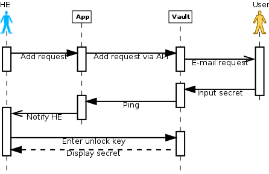

The Vault architecture
======================

Client apps
-----------

Client apps play a fundamental part in the Vault. They are responsible
for issuing *secret requests*, and are notified when users reply to
them.

When created, client apps are issued an *app key* and *secret*, which
are used to authenticate themselves to the Vault. Both the *app key*
and *secret* must be given by the Vault administrator to the person
responsible for integrating the client with the Vault, so that the app
can authenticate itself. There is no mechanism in the Vault to
exchange *app keys* and *secrets*. System administrators should use a secure
media channel to exchange them.

**Important**: Do not confuse *app secrets* with *user secrets*. The
former is part of an *app* credentials that it must inform to be able
to talk to the Vault (much like an "app password"), while the latter is
the secret information engineers want to securely receive from users.

Secret requests
---------------

A *secret request* is issued by apps as a mean of requesting some
secret information from users. After authenticating itself to the
Vault, an app must send the following information to create a *secret
request*:

* The e-mail address of the user it wants the secret from.

* An optional *app data* value, which the Vault will store along the
  request. This opaque value will be sent back when pinging the app,
  and may be used by the app to link Vault requests to its own
  database IDs or tokens.

Upon receiving the *secret request*, the Vault will do the following:

1. Record the request in its database.

2. Generate a random *input key*, and store it alongside the request.

3. Generate an unique URL where the user will be able to input the
   requested secret. The URL points to the Vault front-end form for
   the request, and contains a *message authentication code* (MAC)
   generated using the following formula:

        MAC = HMAC-SHA1(request-id | ' ' | user-email, input-key)

4. Send an e-mail to the user requesting that she visits the unique
   URL.

Secret input
------------

After receiving the *secret request* email, the user might decide to
visit the unique URL. In this URL, she will find a HTML form where the
secret can be entered.

After receiving the secret from the user, the Vault will do the
following:

1. Check the submitted data, to certify that it is legitimate and was
   not tampered with.

2. Generate a random *unlock key*.

3. Encrypt the secret with the *unlock key*. The secret is encrypted
   using the AES-128-CBC algorithm.

4. Generate a MAC from the encrypted secret. This MAC is generated
   using the following formula:

        SECRET-MAC = HMAC-SHA1(encrypted-secret, unlock-key)

5. Store the encrypted secret and MAC in the database.

6. Generate an unique *unlock URL*, that points to the unlock form in
   the Vault front-end. The *unlock URL* will contain a MAC generated
   using the following formula:

        UNLOCK-MAC = HMAC-SHA1(request-id | ' ' | user-email, unlock-key)

5. Erase the request's *input key*, which effectively prevent the user
   to input the secret again by visiting the unique URL.

6. Ping-back the app that issued the request. In this ping-back, the
   Vault will send to the app the *unlock key*, plus the *unlock URL*.

**FIXME:** Derive separate keys for encryption, secret, and URL MAC?

Secret unlocking
----------------

After receiving a ping-back from the Vault informing that the user had
input the requested secret, the client app should use whatever means
to notify the engineer that the secret data is now available. The *app
data* that is linked to the request may be used for this (for example,
the app may use it to store an engineer ID or e-mail address).

When notifying engineers that the request was answered, the app should
send them the *unlock key* and the *unlock URL* it has just received
from the Vault via ping-back.

(It should be stressed here that *unlock keys and URLs* are not tied
to any person or credential in particular, so anyone that possess them
can use them to unlock an user secret, so *care must be taken, both by
the app and the engineer, when managing unlock keys and URLs*.)

With both the *unlock key* and *URL* in hands, the engineer can then
proceed to unlock the secret. When she visits the *unlock URL*, she is
asked to input the *unlock key*.

After receiving the unlock key, the Vault front-end will do the
following:

1. Check that the secret request was valid, and that a secret for it
   was already entered.

2. Ensure that the encrypted secret's MAC, as stored in the database,
   validates using the *unlock key* that was provided by the engineer.

3. Decrypt the secret using the supplied key.

4. Clear the encrypted secret from the database.

5. Finally, display the secret to the engineer.

It should be emphasized that after a user secret is unlocked it is
automatically removed from the Vault, so if any long-term retention of
user secrets is needed, engineers must arrange to securely transmit
then to other specialized tools.

Expiration
----------

Requests and secrets expire after a certain amount of time. The
expiration time is defined in the configuration file.

Some useful diagrams
--------------------

## System architecture

## Overall data flow

